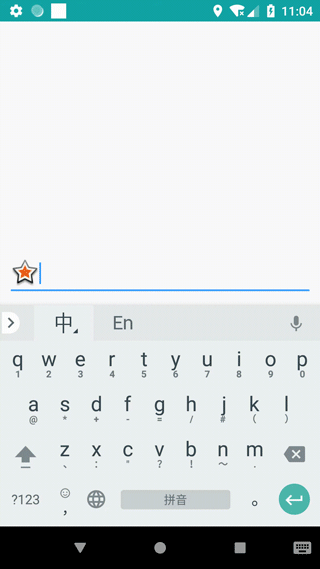

## 常用的自定義UI控件

1. 帶刪除功能的EditText
    
```
    <!--anim:是否开启清除动画-->
    <!--drawableRight: 删除图标,必填-->
    <com.maple.common.DelEditText
        android:layout_width="match_parent"
        android:layout_height="wrap_content"
        app:anim="true" 
        android:drawableLeft="@android:drawable/star_big_on"
        android:drawableRight="@android:drawable/ic_delete" />
```

| DelEditText | ParticleText | 
| :--: | :--: |
|   | |

2. 粒子化文字
    > `setText()` 设置初始文字><br/>
     ` setNextString()` 设置要变化的文字(连续调用改方法,会逐步变化至目标) <br/>
     `setTextSize()` 设置文字大小(单位: dp)
    
```
    <com.maple.common.particle.ParticleTextView
            android:id="@+id/ptv"
            android:layout_centerHorizontal="true"
            android:layout_width="400dp"
            android:layout_height="400dp"/>
```
