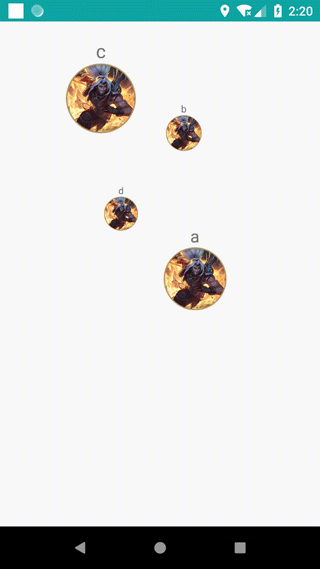
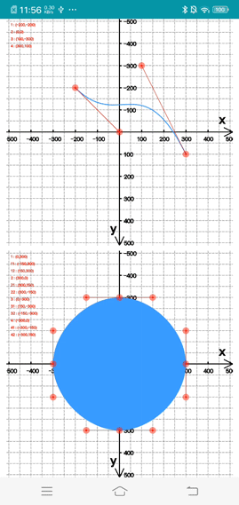
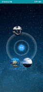

## 常用的自定義UI控件

1. 帶刪除功能的EditText
    
```
    <!--anim:是否开启清除动画-->
    <!--drawableRight: 删除图标,必填-->
    <com.maple.common.DelEditText
        android:layout_width="match_parent"
        android:layout_height="wrap_content"
        app:anim="true" 
        android:drawableLeft="@android:drawable/star_big_on"
        android:drawableRight="@android:drawable/ic_delete" />
```

| DelEditText | ParticleText | 3dTagCloudAndroid|
| :--: | :--: | :--: |
|   | |

2. 粒子化文字
    > `setText()` 设置初始文字><br/>
     ` setNextString()` 设置要变化的文字(连续调用改方法,会逐步变化至目标) <br/>
     `setTextSize()` 设置文字大小(单位: dp)
    
```
    <com.maple.common.particle.ParticleTextView
            android:id="@+id/ptv"
            android:layout_centerHorizontal="true"
            android:layout_width="400dp"
            android:layout_height="400dp"/>
```
3. [一个可拖动的3d标签云](https://github.com/wangfengye/3dTagCloudAndroid),在misakuo/3dTagCloudAndroid的基础上对拖动
效果做了优化,貌似原作者许久不维护了,提了pr没反应.[原作地址](https://github.com/misakuo/3dTagCloudAndroid)

| GridComputingView |DreamLayout|
| :--: | :--: |
|   |   |

4. 自定义View之贝塞尔曲线.
> GridComputingView是一个绘图基类,提供网格线,及点位移动功能,继承该View,通过它提供的点位进行贝塞尔曲线绘制,可以
手动拖动点位来调整View;

5. 自定义星空图,
> 子控件随机显示在布局中

6. 横向渐变色文字Span[HorizonColorfulSpan]
    > 使用 `HorizonColorfulSpan.getColorFulWithCenterEdge(text,colorStart,colorEnd,centerCount)`</br>
    缺陷: 中点依据字符数量确认,不同类型字符宽度不同导致中点偏移
### 第三方控件
1. [手写面板](https://github.com/gcacace/android-signaturepad)本来自己写的,发现个更好用的哭
> 特性: 三次贝塞尔曲线实现笔画圆滑;根据笔画速度控制笔画宽度

#### 模仿QQ.拖拽特效
>  知识点: 贝塞尔曲线,三角函数

#### 粒子爆炸
> 在根部局插入一个全屏控件用于播放动画,根据view构造bitmap,再构造粒子点阵,用于实现动效

* `Particle`:抽象粒子点,实现绘制点,以及每个点的位移
* `ParticleFactory`: 抽象粒子构造器
* `ExplosionField`: 承载动画的控件,也是外部调用时的接口提供者.
* `ExplosionAnimator ` 动画播放器,`draw()`控制全部粒子的位置改变,和绘制.

#### 不规则图形点击事件

* canvas 绘制
* 图形区分
    * 像素点取色
    * `Region`类提供的Path包含判断

#### 树生长动画
> 贝塞尔曲线应用,计算贝塞尔曲线中间点位置:1.代入贝塞尔公式运算;2.使用`PathMeasure`提供的native方法.

 * todo:相较于自己计算,系统的PtahMeasure,按路径百分比取点,点分布,前密后松,

 #### 震荡动画
 > 贝塞尔曲线应用,组合动画,动画插值器,震荡函数,自由落体.

  #### 卡片列表滑动
  > CoordinatorLayout.Behavior, NestedScrollingParent2,NestedScrollingChild2